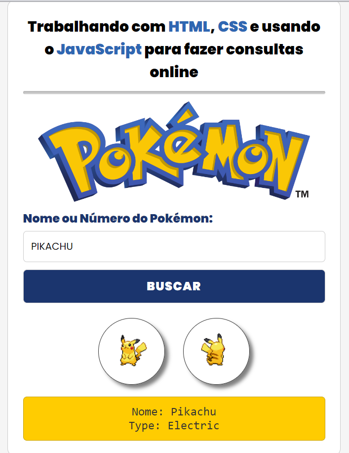

<h1 align="center"> Pokedex 🎮 </h1>

  <a href="#-tecnologias">Tecnologias</a>&nbsp;&nbsp;&nbsp;|&nbsp;&nbsp;&nbsp;
  <a href="#-projeto">Projeto</a>

 

  

## 🚀 Tecnologias
Esse projeto foi desenvolvido com as seguintes tecnologias:

- HTML e CSS

- JavaScript

- Git e Github

- Api pokemon

## 💻 Projeto

Pokedex utilizando a api pokemon para realizar buscas dos pokemons.
